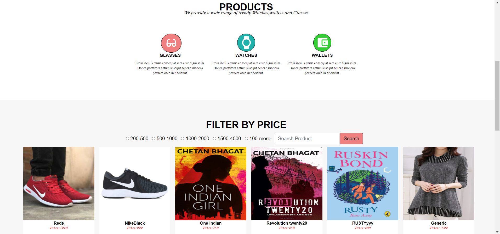

## ShoppingCart
full stack shopping cart using angular and spring framework

## Technologies
Project is created with:
* Frontend-Angular
* Backend-SpringBoot
* Database-Mysql
	
## Setup
To run this project, install IntellijCommunity or enterprise
```
$ cd to frontend and backend 
$ run the project
```
## Features:

* Login-Signup
* Add,Update,Delete,Show Product
* View Cart
* Order History
* update profile

# SHOPPIFY


## LOGIN PAGE


## SIGNUP PAGE


## PRODUCTS


## VIEW PRODUCT DETAILS


## CART


## ORDERHISTORY


## EDIT PROFILE


## UPDATE PRODUCT--BY ADMIN ONLY


## ADD PRODUCT--BY ADMIN ONLY

